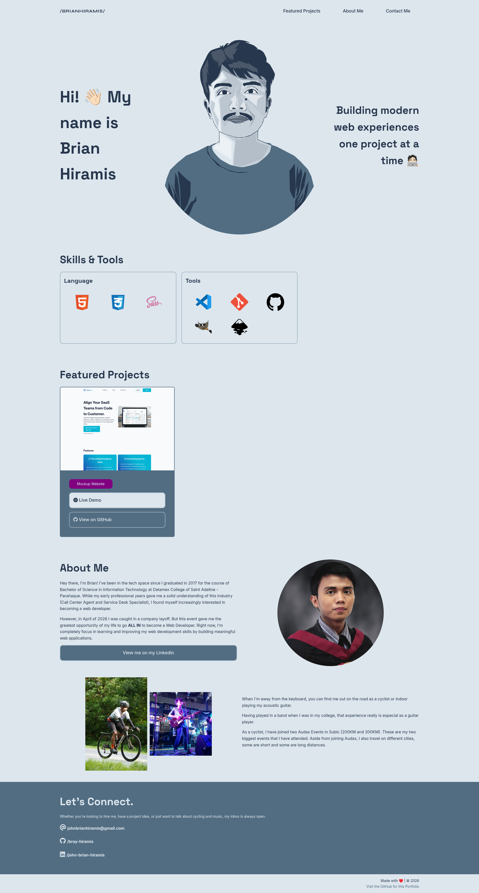
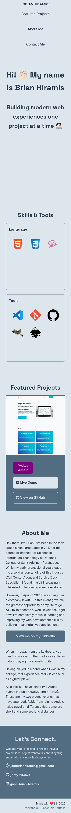

# Brian Hiramis | My Personal Portfolio

<strong>My portfolio website to showcase my projects and skills in Web Development</strong>

## Features

- <strong>Hero Section</strong> - My self introduction.
- <strong>Featured Projects</strong> - Showcasing my web development projects.
- <strong>Skills</strong> - List of my current Tech Stack and Tools.
- <strong>About Me</strong> - My hobbies and goals.
- <strong>Contact Me</strong> - How to reach out to hire me.

## Visual Demo

<strong>Live Demo:</strong> <a href="http://brianhiramis.com">brianhiramis.com</a>

<strong>Screenshot:</strong>
| Desktop View | Mobile View |
| ------------ | ----------- |
|  |  |

## Getting Started

Please visit the Live Demo or you can clone this repo.

```
git clone https://github.com/bray-hiramis/brianhiramis.git
cd brianhiramis
```
## Things that I learned

- Proper alignment of elements.
- Using css <code>clamp()</code> function to create a responsive typography.
- Consistent typography and color balance.
- Deploying the website with custom domain through Netlify.

## Tech Stack

- HTML
- SASS (CSS pre-compiler)

## Future Enhancement

- Add interactivity using JavaScript
- Add Dark Mode
- Rewrite in React
- Full Stack Portfolio

## Author

<strong>&ndash; Brian Hiramis</strong>